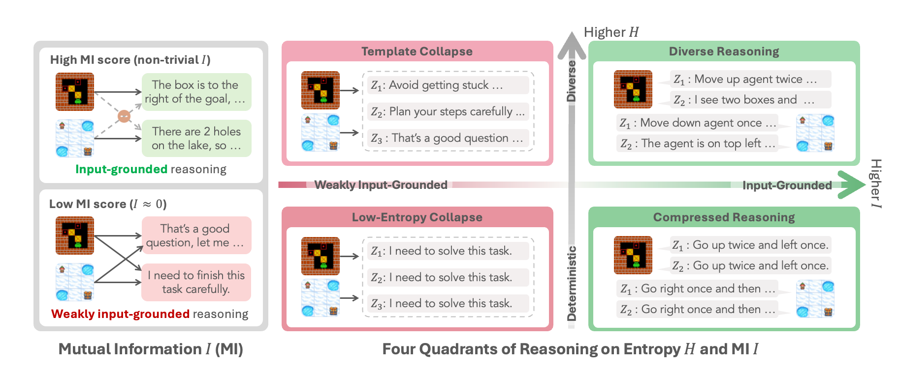

<h1 align="center">RAGEN: Training Agents by Reinforcing Reasoning</h1>
<h3 align="center"><em>Diagnose agent failure modes. Make your RL training better.</em></h3>

<p align="center"></p>

<p align="center">
  <strong>RAGEN</strong> (<b>R</b>easoning <b>AGEN</b>T) is a flexible RL framework for training reasoning agents.
</p>
<p align="center">
  We develop <strong>diagnostics to understand <i>how</i> agent RL training works </strong>, and how to fix hidden issues.
</p>

<p align="center">
  <a href="https://arxiv.org/abs/2604.06268"></a>
  <a href="https://arxiv.org/abs/2504.20073"></a>
  <a href="https://ragen-ai.github.io/"></a>
  <!-- <a href="https://ragen-doc.readthedocs.io/"></a> -->
  <a href="#"></a>
  <a href="#"></a>
</p>

> **Looking for the V1 README?** Please take a look [here](docs/readme_v1.md).

## News

- **2026.3.12.** We are excited to release <font color="#DC143C">RAGEN-2</font>! We introduce a systematic study of reasoning collapse in agent RL and lightweight interventions for stable training. See the [<font color="#DC143C">v2 paper</font>](https://ragen-ai.github.io/v2).
- **2025.4.20.** RAGEN V1 [paper](https://arxiv.org/abs/2504.20073) published on arXiv.
- **2025.1.27.** Initial RAGEN release.


## About

RAGEN is built around **StarPO** (**S**tate-**T**hinking-**A**ctions-**R**eward **P**olicy **O**ptimization), a unified RL framework for training multi-turn, trajectory-level agents with flexible control over reasoning processes, reward assignment mechanisms, and prompt-rollout structures.

**RAGEN is flexible with:**

- **StarPO framework.** Unified optimization for multi-turn agents, supporting both trajectory-level and turn-wise training.
- **10 built-in environments.** Sokoban, FrozenLake, WebShop, DeepCoder, SearchQA, Lean, Bandit, Countdown, MetaMathQA, Sudoku.
- **Gym-compatible interface.** Easy to add custom environments.

**<font color="#DC143C">RAGEN-2</font> additionally introduces:**

- **SNR-Adaptive Filtering (<font color="#DC143C">V2</font>).** Lightweight rollout filtering based on reward variance to mitigate noisy gradient updates.
- **Reasoning collapse diagnostics (<font color="#DC143C">V2</font>).** Mutual information proxy metrics to detect and monitor template collapse during training.


## Algorithm

### StarPO: Reinforcing Reasoning via Trajectory-Level Optimization

<p align="center"></p>
<p align="center" style="font-size: 16px; max-width: 800px; margin: 0 auto;">
The StarPO (State-Thinking-Action-Reward Policy Optimization) framework with two interleaved stages: <b>rollout stage</b> and <b>update stage</b>. The LLM generates reasoning-guided actions to interact with the environment, collecting trajectory-level rewards to jointly optimize reasoning and action strategies.
</p>

**MDP Formulation.** Agent-environment interactions are formulated as Markov Decision Processes (MDPs) where states and actions are token sequences, allowing LLMs to reason over environment dynamics. The objective is to maximize expected cumulative rewards across multiple interaction turns.

**Rollout Stage.** Given an initial state, the LLM generates multiple trajectories. At each step, the model produces a reasoning-guided action: `<think>...</think><ans> action </ans>`. The environment returns feedback (reward and next state).

**Update Stage.** StarPO optimizes entire trajectories using importance sampling. It supports:
- **PPO.** Token-level advantage estimation via a value function over trajectories.
- **GRPO.** Normalized reward assigned to the full trajectory.

### <font color="#DC143C">V2</font>: Diagnosing Template Collapse

Entropy alone cannot detect *template collapse*, where reasoning appears diverse within a single input but becomes input-agnostic across inputs. <font color="#DC143C">RAGEN-2</font> decomposes reasoning quality into two axes:
- **Within-input diversity:** Conditional Entropy H(Z|X)
- **Cross-input distinguishability:** Mutual Information I(X;Z)

SNR-Adaptive Filtering uses reward variance as a lightweight proxy to select high-signal prompts each iteration, directly addressing the root cause of template collapse.


## Update Log

**2026.3.12.** <font color="#DC143C">RAGEN-2</font> is released! Check out our [<font color="#DC143C">v2 paper</font>](https://ragen-ai.github.io/v2).

<details>
<summary>Older updates</summary>

**2025.5.8.** Official [Documentation](https://ragen-doc.readthedocs.io/) released. NOTE: this document is now outdated.

**2025.5.2.** A [tracking document](https://docs.google.com/document/d/1bg7obeiKTExuHHBl5uOiSpec5uLDZ2Tgvxy6li5pHX4/edit?usp=sharing) for logging minor codebase updates is released.

**2025.4.20.** RAGEN V1 [paper](https://arxiv.org/abs/2504.20073) published. Codebase restructured: veRL integrated as a submodule; architecture decomposed into three modules — Environment State Manager, Context Manager, and Agent Proxy.

**2025.3.13.** RAGEN codebase refactoring underway.

**2025.3.8.** KL term issue in veRL [fixed](https://github.com/volcengine/verl/pull/179/files). Default advantage estimator changed to GAE (PPO) for more stable training.

**2025.1.27.** Initial RAGEN release.

</details>


## Getting Started

```bash
git clone https://github.com/mll-lab-nu/RAGEN.git
cd RAGEN
conda create -n ragen python=3.12 -y && conda activate ragen
bash scripts/setup_ragen.sh
```

Use `bash scripts/setup_ragen.sh --with-search` to include the search environment. For WebShop, see [docs/experiment_webshop_release.md](docs/experiment_webshop_release.md).

## Agent Budget Control

This repository extends RAGEN with budget-aware agent training, rollout logging, and offline budget-estimation benchmarks. The main question is whether an agent can reason about the remaining resources needed to finish a task under explicit constraints such as turns, tokens, action points, time, inventory occupancy, or cumulative cost.

The additions live in a few places:

| Path | Purpose |
| --- | --- |
| `config/base.yaml`, `config/evaluate_api_llm.yaml` | Budget-control flags under `agent_proxy`, including estimation, compliance, and mixed-budget training modes. |
| `ragen/wrapper/ctx_manager_wrapper.py`, `ragen/llm_agent/ctx_manager.py` | Prompt injection and dialogue logging for budget-aware rollouts. |
| `ragen/wrapper/es_manager_wrapper.py`, `ragen/llm_agent/es_manager.py` | Per-rollout budget sampling and reward shaping for turn, token, and tool-call budgets. |
| `ragen/env/token_estimation` | Offline token-budget estimation environment for Sokoban, SearchR1, SWE-bench style dialogue logs, and similar rollouts. |
| `ragen/env/money_estimation` | Offline warehouse-budget estimation environment for time, warehouse item-weeks, and cumulative cost. |
| `ragen/env/robotouille` | Robotouille action-point budget wrapper. |
| `scripts/evaluation-scripts/origin` | Scripts that collect original task rollouts and dialogue JSON logs. |
| `scripts/evaluation-scripts/eval` | Second-pass budget-estimation scripts that call API models on logged rollouts. |
| `scripts/training` | RL training wrappers for plain and mixed-budget WebShop / Robotouille runs. |
| `figure/agent-budget-control` | Analysis scripts, generated summaries, tables, and figures. |

Most local scripts assume the conda environment is named `ragenv2` and that this repo is at `$HOME/agent-budget-control`. If your setup differs, either set `PROJECT_ROOT` before running scripts or edit the activation line.

```bash
conda activate ragenv2
cd "$HOME/agent-budget-control"
export PYTHONPATH="$PWD:$PWD/verl"
```

For API-based evaluation, export the provider key used by the selected `MODEL_NAME`:

```bash
export OPENAI_API_KEY=...
export ANTHROPIC_API_KEY=...
export OPENROUTER_API_KEY=...
export GEMINI_API_KEY=...
export TOGETHER_API_KEY=...
export DEEPSEEK_API_KEY=...
```

### Collect Original Rollouts

The `origin` scripts run the task model and write both the rollout pickle and a dialogue log. The dialogue JSON is the input to the offline budget-estimation benchmark.

```bash
MODEL_NAME=OpenAI-5.2-Instant \
VAL_GROUPS=128 \
OUTPUT_DIR="$PWD/results/estimation/sokoban-origin-gpt5.2-instant-128-main" \
bash scripts/evaluation-scripts/origin/sokoban.sh
```

Output files are written under `OUTPUT_DIR`. The budget-estimation input log is named like:

```text
<RUN_NAME>_eval_estimation_dialogues.json
```

For SearchR1, start the retrieval server first unless you intentionally use mock retrieval:

```bash
bash scripts/evaluation-scripts/origin/searchr1_server.sh start

MODEL_NAME=OpenRouter-Gemini-3.1-Pro-Preview \
SEARCH_MOCK_MODE=False \
bash scripts/evaluation-scripts/origin/searchr1.sh
```

Use `bash scripts/evaluation-scripts/origin/searchr1_server.sh status` or `logs` to inspect retrieval-server state.

### Run Offline Budget Estimation

The second-pass evaluators read saved dialogue or rollout JSON files and ask another model to judge whether the rollout can still finish within budget. They also ask for a remaining-resource interval when the answer is feasible.

Sokoban token-budget estimation:

```bash
INPUT_JSON="$PWD/results/estimation/sokoban-origin-gpt5.2-instant-128-main/sokoban_api_eval_estimation_eval_estimation_dialogues.json" \
MODEL_NAME=qwen/qwen3-235b-a22b-2507 \
MAX_CONTEXT_WINDOW_TOKENS=2500 \
bash scripts/evaluation-scripts/eval/sokoban.sh
```

SearchR1 token-budget estimation:

```bash
INPUT_JSON="$HOME/database/origin/searchr1-origin-gpt5.2-instant-128-main/search_r1_api_eval_estimation_eval_estimation_dialogues.json" \
MODEL_NAME=qwen/qwen3-235b-a22b-2507 \
MAX_CONTEXT_WINDOW_TOKENS=3500 \
bash scripts/evaluation-scripts/eval/searchr1.sh
```

Warehouse budget estimation:

```bash
INPUT_SOURCE="$HOME/database/origin/newwarehouse-qwen/combined_qwen3-235b_128seeds_harsh.json" \
MODEL_NAME=qwen/qwen3-235b-a22b-2507 \
BUDGET_PRESET=half-reachable \
bash scripts/evaluation-scripts/eval/warehouse.sh
```

`INPUT_SOURCE` may be a single JSON file or a directory of JSON rollout files. The warehouse runner supports:

- `BUDGET_PRESET=half-reachable`: samples half reachable and half impossible constraints.
- `BUDGET_PRESET=per_traj_final_turn_reachable`: derives budgets from each rollout's final realized values.
- `TARGET_CASH_USD`, `TIME_BUDGET_WEEKS`, `WAREHOUSE_BUDGET_ITEM_WEEKS`, `COST_BUDGET_USD`: absolute budget overrides.
- `TARGET_CASH_RATIO`, `TIME_BUDGET_RATIO`, `WAREHOUSE_BUDGET_RATIO`, `COST_BUDGET_RATIO`: per-rollout ratio budgets when absolute values are not set.

All eval scripts write:

- `OUTPUT_JSON`: aggregate predictions, ground truth, API usage, and summary metrics.
- `TEMP_JSON`: exported prompt / target pairs for inspection.

Set `DRY_RUN=1` to build `TEMP_JSON` and validate prompts without calling the API.

```bash
DRY_RUN=1 MAX_SAMPLES=5 INPUT_JSON=/path/to/dialogues.json \
bash scripts/evaluation-scripts/eval/sokoban.sh
```

The low-level runners are also available directly:

```bash
python scripts/budget-estimation-benchmark/run_token_estimation_env.py --help
python scripts/budget-estimation-benchmark/run_money_estimation_env.py --help
```

### Online Estimation And Compliance Modes

Budget-aware rollout prompts are configured under `agent_proxy`:

| Flag | Meaning |
| --- | --- |
| `eval-estimation-single=True` | Ask the agent for `<budget-thinking>` and `<token_estimation>` in a mostly single-turn setting. |
| `eval-estimation-multi=True` | Ask for `<turn_estimation>` and `<token_estimation>` during multi-turn rollouts. |
| `eval-estimation-toolcall=True` | Ask Robotouille agents for remaining and current-turn action-point estimates. |
| `eval_adaptation_turn=True` | Ask for multi-turn estimates while changing the suggested budget at a configured turn. |
| `eval_compliance_token=True` | Evaluate responses under token-budget compliance prompts. |
| `eval_compliance_turn=True` | Evaluate responses under turn-budget compliance prompts. |
| `eval_compliance_toolcall=True` | Evaluate Robotouille action-point budget compliance. |
| `no_budget_prompt=True` | Suppress the default "actions left" budget text in the task prompt. |

Only one estimation or compliance mode should be enabled at a time. Scope fields such as `eval_compliance_turn_scope`, `eval_compliance_token_scope`, and `eval_compliance_toolcall_scope` define the tested budget values. For adaptive turn budgets, use:

```bash
"agent_proxy.eval_adaptation_turn=True" \
"agent_proxy.eval_adaptation_turn_scope=[3,6,4]"
```

This means the suggested budget is `6` through turn `3`, then changes to `4`.

### Mixed-Budget RL Training

Mixed-budget RL samples a per-environment budget and scales the task reward by whether the rollout stays within that budget. The soft reward curve uses a tanh decay controlled by `tau`; setting `use_hard=True` switches to a hard cutoff after the budget is exceeded.

Core Hydra controls:

```yaml
agent_proxy:
  mixed_turn_budget:
    enabled: True
    mixed_budget: True
    mixed_budget_range: [2, 6]
    reward_curve:
      use_hard: false
      tau: 1.0
  mixed_token_budget:
    enabled: False
  mixed_toolcall_budget:
    enabled: False
```

WebShop plain RL:

```bash
bash scripts/training/webshop/mixed-budget-training-webshop-origin.sh \
  --gpus 0,1,2,3 \
  --steps 100
```

WebShop mixed turn-budget RL:

```bash
bash scripts/training/webshop/mixed-budget-training-webshop-mixed.sh \
  --gpus 0,1 \
  --mixed-turn-range 2,6 \
  --steps 100
```

Robotouille fixed action-budget RL:

```bash
bash scripts/training/robotouille/mixed-budget-training-robotouille-origin.sh \
  --gpus 0,1,2,3 \
  --max-action-points 25
```

Robotouille mixed tool-call/action-point budget RL:

```bash
bash scripts/training/robotouille/mixed-budget-training-robotouille-mixed-toolcall.sh \
  --gpus 0,1,2,3 \
  --mixed-toolcall-range 10,20 \
  --max-action-points 25
```

Use `PREFLIGHT_ONLY=1` to construct and print the training command without launching training:

```bash
PREFLIGHT_ONLY=1 bash scripts/training/webshop/mixed-budget-training-webshop-mixed.sh
```

`mixed_toolcall_budget` is only valid for Robotouille. It automatically enables `custom_envs.Robotouille.env_config.enable_action_budget=True` and sets `max_action_points` from the sampled budget.

### Analysis Figures

Budget-control results are summarized under `figure/agent-budget-control`. Per-run folders contain `summary.md` and generated PNG figures. The overall table is in `figure/agent-budget-control/overall/table1.md`.

```bash
python figure/agent-budget-control/generate_all_figures.py
```

The current figure generator is configured for local `$HOME/database/...` result paths. If you run on a different machine or result root, update the `DatasetConfig` paths in `figure/agent-budget-control/generate_all_figures.py`.

### The Four Reasoning Regimes

<font color="#DC143C">RAGEN-2</font> diagnoses agent behavior along two axes — **within-input diversity** (Conditional Entropy) and **cross-input distinguishability** (Mutual Information) — yielding four distinct reasoning regimes:

<p align="center"></p>
<p align="center" style="font-size: 15px; max-width: 800px; margin: 0 auto;">
<b>Left:</b> Input-driven reasoning adapts to the current state; templated reasoning produces nearly identical responses across different inputs. <b>Right:</b> Four reasoning regimes along two axes — conditional entropy H(Z|X) (within-input diversity) and mutual information I(X;Z) (input dependence). Template collapse (high entropy, low MI) is invisible to existing entropy-based metrics.
</p>

**Train (no filter, default):**
```bash
python train.py --config-name _2_sokoban
```

**Train with SNR-Adaptive Filtering (<font color="#DC143C">V2</font>, Top-p):**
```bash
python train.py --config-name _2_sokoban \
  actor_rollout_ref.rollout_filter_strategy=top_p \
  actor_rollout_ref.rollout.rollout_filter_value=0.9
```

**Evaluate:**
```bash
python -m ragen.llm_agent.agent_proxy --config-name _2_sokoban
```

SNR-Adaptive Filtering consistently improves training across algorithms, model scales, and modalities (green = gain from filtering):

<p align="center"></p>

See the [Rollout Filtering Guide](docs/guide_rollout_filtering.md) for more filtering strategies (Top-k, linear mode, etc.).


## Future Plans

We are actively developing the next generation of RAGEN infrastructure and diagnostics.

**Infrastructure**
- [ ] **Async rollout engine** 
- [ ] **HTTP-based environment interface** 
- [ ] **Layered Env Wrapper** 
- [ ] **Optional environment dependencies** 

**Diagnostics & Training Quality**
- [ ] **Expanded benchmark suite** to stress-test diagnostics across diverse, real-world agent tasks
- [ ] **Extended MI diagnostic dashboard**, including richer WandB visualizations for entropy, MI proxy, and gradient decomposition over training
- [ ] **RL training metrics guide**, including a practitioner's blog on how to read training signals (reward distribution, entropy, MI, gradient norms) and act on them before committing to a full run

**Framework**
- [ ] Update full documentation for <font color="#DC143C">RAGEN-2</font>
- [ ] Multi-modal agent support (building upon [VAGEN](https://github.com/RAGEN-AI/VAGEN))
- [ ] Public leaderboard for benchmark results


## Documentation

- [Full Documentation](https://ragen-doc.readthedocs.io/) *(We will release an updated version soon.)*
- [Agent Budget Control](#agent-budget-control) - Budget-aware rollout logging, offline estimation, mixed-budget RL, and analysis scripts
- [Evaluation Guide](docs/eval.md) — How to evaluate models and configure output formats
- [Rollout Filtering Guide](docs/guide_rollout_filtering.md)
- [MI Metrics Reference](docs/reference_mutual_information_metrics.md)
- Adding Custom Environments — Gym-compatible interface, see `config/envs.yaml`
- Experiment reproduction: [Main Table](docs/experiment_main_table.md) | [Intervention Sweep](docs/experiment_intervention_sweep.md) | [FrozenLake](docs/experiment_frozen_lake_slipper_sweep.md) | [Sokoban Gradient](docs/experiment_sokoban_gradient_analysis.md) | [Search](docs/experiment_search.md) | [DeepCoder](docs/experiment_deepcoder.md) | [WebShop](docs/experiment_webshop_release.md)


## Awesome Work Powered or Inspired by RAGEN

- [ROLL](https://github.com/alibaba/ROLL): Efficient Scaling Library for RL with LLMs 
- [VAGEN](https://github.com/RAGEN-AI/VAGEN): Training Visual Agents with multi-turn RL 
- Search-R1: Train LLMs to reason and call a search engine with RL
- [ZeroSearch](https://github.com/Alibaba-nlp/ZeroSearch): Incentivize LLM search capability without searching 
- [Agent-R1](https://github.com/AgentR1/Agent-R1): Training Powerful LLM Agents with End-to-End RL
- [OpenManus-RL](https://github.com/OpenManus/OpenManus-RL): RL tuning for LLM agents 
- MetaSpatial: Reinforcing 3D Spatial Reasoning in VLMs
- s3: Efficient Yet Effective Search Agent Training via RL


## Star History

[](https://www.star-history.com/#mll-lab-nu/ragen&Date)


## Citation

```bibtex
@misc{ragen2,
      title={RAGEN-2: Reasoning Collapse in Agentic RL}, 
      year={2026},
      eprint={2604.06268},
      archivePrefix={arXiv},
      primaryClass={cs.LG},
      url={https://arxiv.org/abs/2604.06268}, 
}
```

```bibtex
@misc{ragen,
      title={RAGEN: Understanding Self-Evolution in LLM Agents via Multi-Turn Reinforcement Learning},
      year={2025},
      eprint={2504.20073},
      archivePrefix={arXiv},
      primaryClass={cs.LG},
      url={https://arxiv.org/abs/2504.20073},
}
```
