# Sokoban GPT-5.2 Instant New 图表报告

## 实验设置

- Rollout 数据：
  `/u/ylin30/database/origin/sokoban-origin-gpt5.2-instant-128-main-new/sokoban_api_eval_estimation_eval_estimation_dialogues.json`
- Estimation 数据：
  `/u/ylin30/database/estimation/sokoban-origin-gpt5.2-instant-128-main-new_gpt5.2-instant-token-estimation-test/sokoban-origin-gpt5.2-instant-128-main-new_gpt5.2-instant-token-estimation-test.json`
- 预算定义：
  `max_context_window_tokens = 2500`
- 当前 estimation task 的目标：
  - 判断这条 rollout 到 finishing turn 为止，是否能把 finishing-turn footprint 控制在 budget 内。
  - 如果能，预测从当前状态到 finishing turn 还需要增加多少 `input + output` token footprint。

## 总体结论

这套结果最强地支持了 `storyline.md` 中的两个判断：

- `online budget estimation` 不是平凡问题。
- 模型存在明显的 `selective failure`：在最需要预警的失败轨迹上，仍然持续预测“能完成”。

最关键的数字是：

- Rollout success rate：`0.352`
- 第一轮 `can-finish` 判断准确率：`0.373`
- 后续 turn 的总体判断准确率：`0.387`
- 在 `actual_success` 样本上，模型预测 `can finish` 的比例：`0.958`
- 在 `actual_fail` 样本上，模型仍预测 `can finish` 的比例：`0.767`
- 在 `actual_success + predicted_success` 样本里，区间命中率只有：`0.417`

一句话说：

- 模型并不是“什么都不会估”。
- 它对真实能完成的轨迹，大多数时候会继续说“能完成”。
- 但真正危险的是：对真实不能完成的轨迹，它也经常继续说“能完成”。
- 这正是 `storyline` 里想强调的 `selective failure`。

## Figure 1

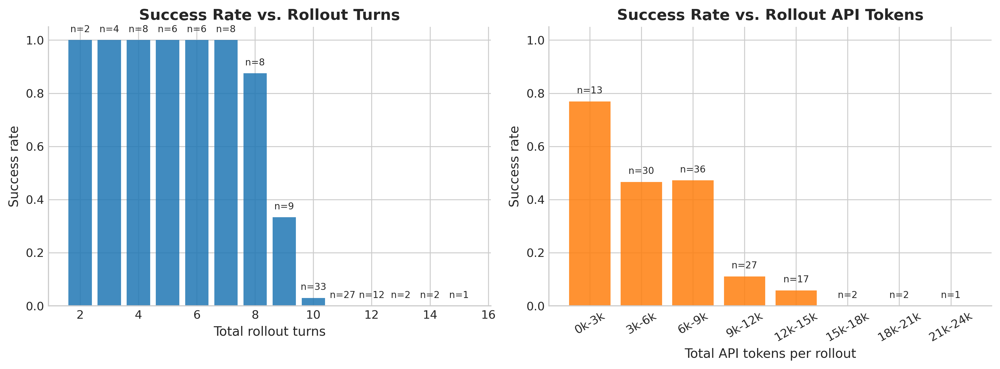

这张图主要想证明：
- `storyline` 中“budget 是一个真实部署约束，而不是附属统计量”这一背景判断。

图里元素是什么意思：
- 左图横轴：总 turn 数。
- 左图纵轴：success rate。
- 左图柱子：对应 turn 数 bucket 内的成功率。
- 左图柱子上方的 `n=...`：该 bucket 的样本数。
- 右图横轴：总 API token bucket。
- 右图纵轴：success rate。
- 右图柱子：对应 token bucket 内的成功率。

从图里能看到什么：
- rollout 越长、总 token 越高，成功率通常越低。
- 这说明在 Sokoban 里，预算不是事后才看的日志指标，而是和任务是否能成直接相关。

它对 storyline 的支持程度：
- `背景支持`
- 这张图不能直接证明 `selective failure`，但它证明了后面的预算估计问题是值得研究的。

## Figure 2

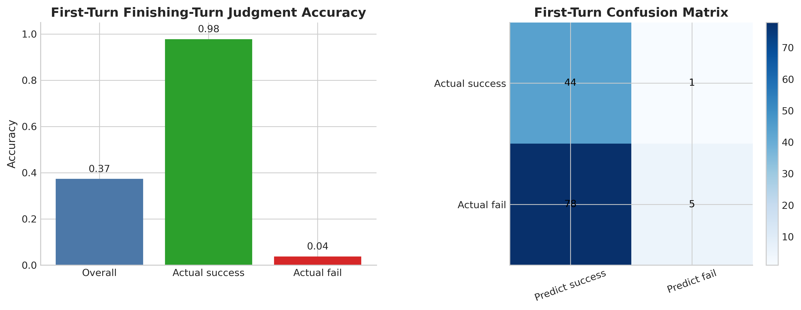

这张图主要想证明：
- `storyline` 中“online estimation 不是平凡问题”。
- 以及“错误不是后期才出现的，第一轮就已经存在”。

图里元素是什么意思：
- 左图横轴：`Overall`、`Actual success`、`Actual fail`
- 左图纵轴：第一轮 `can-finish` 判断准确率。
- 左图柱子高度：对应组别的准确率。
- 右图是 confusion matrix：
  - 行：真实标签
  - 列：模型判断
  - 颜色越深：数量越多

从图里能看到什么：
- 第一轮总体准确率只有 `0.373`。
- 但这个平均值非常误导。
- 在第一轮：
  - `actual_success` 上的准确率约 `0.978`
  - `actual_fail` 上的准确率只有约 `0.037`
- 也就是说，模型第一轮几乎总是乐观地说“能完成”；这对成功样本是对的，但对失败样本几乎完全没起到预警作用。

它对 storyline 的支持程度：
- `强支持`
- 它已经直接显示出一种不对称：模型不是“平均地差”，而是在失败样本上尤其不会预警。

## Figure 3

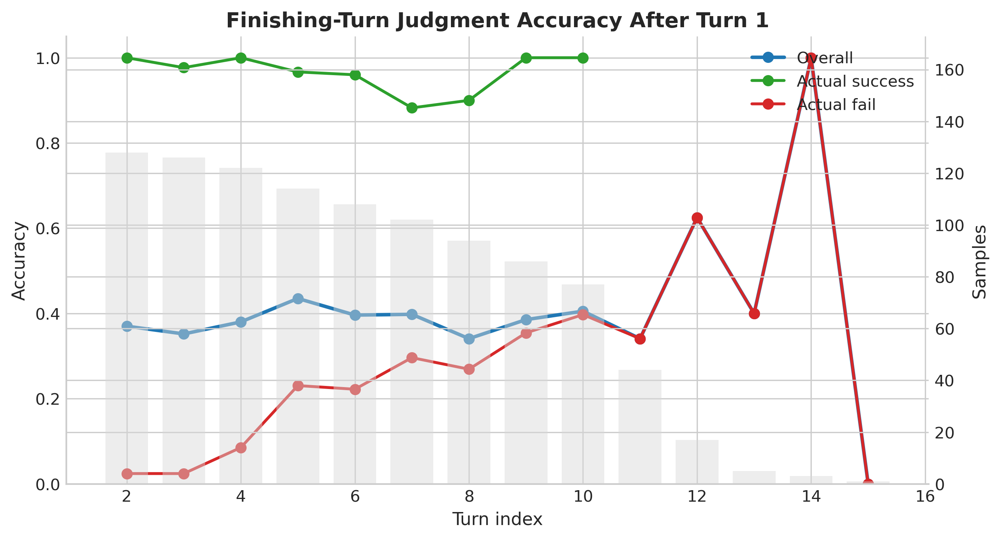

这张图主要想证明：
- `storyline` 中“只看第一轮不够，要看 trajectory-level 的动态”。

图里元素是什么意思：
- 横轴：`turn index`
- 左轴：判断准确率
- 右轴：样本数
- 蓝线：所有样本的平均准确率
- 绿线：只在 `actual_success` 样本上计算的准确率
- 红线：只在 `actual_fail` 样本上计算的准确率
- 灰色柱：该 turn 的样本数

从图里能看到什么：
- 后续 turn 的总体准确率仍然只有 `0.387`，并没有明显变成一个可靠 estimator。
- 更关键的是：
  - `actual_success` 上的准确率一直很高，后续总体约 `0.972`
  - `actual_fail` 上的准确率依然很低，后续总体也只有约 `0.228`
- 也就是说，执行推进并没有根治失败轨迹上的误判。

它对 storyline 的支持程度：
- `强支持`
- 它支持“这个问题不是只在开头存在，而是整条轨迹上都存在”。
- 但这张图仍然是 accuracy 视角，还没有直接把 `selective failure` 的方向性完全画出来，所以还需要 Figure 8。

## Figure 4

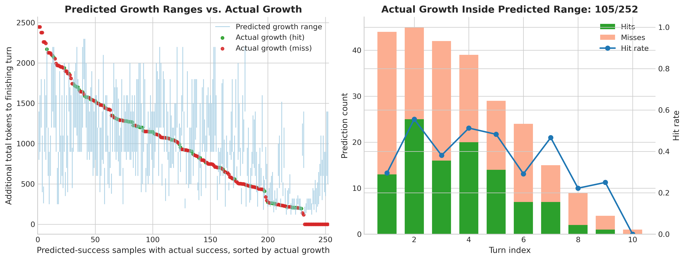

这张图主要想证明：
- `storyline` 中“binary judgment 对了，不代表 interval quality 就好”。

图里元素是什么意思：
- 左图只保留 `actual_success + predicted_success` 的样本。
- 左图横轴：按真实 `actual growth` 从大到小排序后的样本。
- 左图纵轴：到 finishing turn 还需要增长的总 token。
- 左图浅蓝色竖线：预测区间 `[pred_low, pred_high]`
- 左图绿色点：真实值命中区间
- 左图红色点：真实值未命中区间
- 右图横轴：`turn index`
- 右图绿色柱：命中数
- 右图粉色柱：未命中数
- 右图蓝线：命中率

从图里能看到什么：
- 即使把样本限制到“真实可完成，而且模型也判断可完成”，区间命中率仍然只有 `0.417`。
- 这说明问题不只在 binary judgment 层。
- 模型即便说“能完成”，它给出的数值区间也经常不准。

它对 storyline 的支持程度：
- `中等支持`
- 它不直接证明 `selective failure`，但它证明了 interval estimation 本身也很弱，支持了 `storyline` 中“coverage / tightness 要分开看”的说法。

## Figure 5

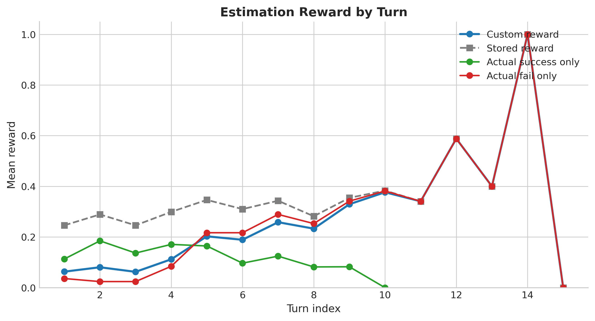

这张图主要想证明：
- `storyline` 中“平均 reward 会混淆不同失效模式”。

图里元素是什么意思：
- 横轴：`turn index`
- 纵轴：平均 reward
- 蓝线：更严格的 `custom reward`
- 灰色虚线：结果文件自带的 `stored reward`
- 绿线：只在 `actual_success` 样本上的 `custom reward`
- 红线：只在 `actual_fail` 样本上的 `custom reward`

Figure 5 里用到的符号：

- 真实是否能完成：`y`
- 模型判断是否能完成：`\hat{y}`
- 真实 remaining growth：`R`
- 模型预测区间：`[\hat{R}_{low}, \hat{R}_{high}]`
- 区间宽度：`W = \hat{R}_{high} - \hat{R}_{low}`

`custom reward` 的计算公式：

```text
如果 y = 1:
  r_custom =
    max(0, 1 - W / R),   如果  \hat{R}_{low} <= R <= \hat{R}_{high}
    0,                   否则

如果 y = 0:
  r_custom =
    1,   如果模型输出 impossible
    0,   否则
```

也就是说：
- 对真实可完成样本，必须先命中真值区间才有分。
- 命中之后，区间越窄，reward 越高。
- 对真实不可完成样本，只有明确回答 `impossible` 才拿满分。

`stored reward` 的计算公式：

先定义两个 0/1 指示变量：

```text
I_finish = 1[\hat{y} = y]
I_range  = 1[\hat{R}_{low} <= R <= \hat{R}_{high}]
```

结果文件里的 `stored reward` 是：

```text
如果 y = 1 且模型给出了区间:
  r_stored = (I_finish + I_range) / 2

否则:
  r_stored = I_finish
```

也就是说：
- 它会奖励 `can-finish` 判断是否正确。
- 在真实可完成且给了区间的情况下，再额外奖励“区间是否覆盖真值”。
- 它不惩罚区间过宽，所以比 `custom reward` 更宽松。

从图里能看到什么：
- `stored reward` 平均约 `0.312`，明显高于 `custom reward` 的 `0.190`。
- 这说明只看较宽松的 reward，会高估 estimator 的实际可用性。
- 红线在一些后期 turn 上会上升，说明模型到很晚的时候，终于开始在部分失败轨迹上说 `impossible`。
- 但绿线整体并不高，说明在真实能完成的样本上，模型对剩余 budget 的区间估计仍然不够扎实。

它对 storyline 的支持程度：
- `中等支持`
- 它支持“平均 reward 不够”和“不同类型样本的失效模式不同”。
- 但它仍然不是最直接证明 `selective failure` 的图。

## Figure 5.2

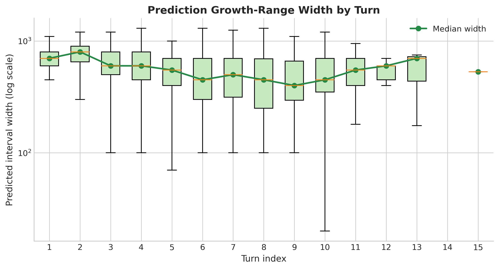

这张图主要想证明：
- `storyline` 中关于 `tightness` 的部分。

图里元素是什么意思：
- 横轴：`turn index`
- 纵轴：预测区间宽度，log scale
- 箱线图：每个 turn 上区间宽度的分布
- 绿色线：每个 turn 的区间宽度中位数

从图里能看到什么：
- 成功样本上的区间宽度中位数确实在前半段有下降趋势：
  - turn 1 约 `700`
  - turn 4 约 `550`
  - turn 6 约 `400`
  - turn 8 约 `240`
- 这支持“区间会收缩”。
- 但这张图本身不告诉我们：收缩之后 coverage 是否真的同步变好。

它对 storyline 的支持程度：
- `部分支持`
- 它支持“success trajectory 上区间会缩窄”。
- 但它不能单独支持“最终覆盖真值会稳定改善”。

## Figure 6

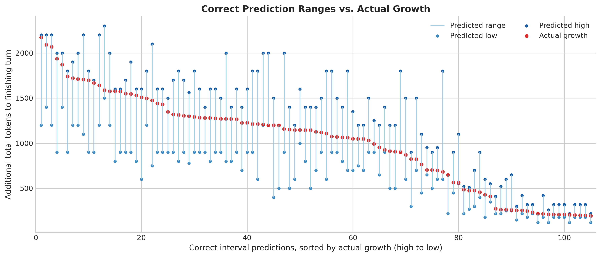

这张图主要想证明：
- `storyline` 中“命中真值”和“给出有用区间”不是一回事。

图里元素是什么意思：
- 横轴：只保留区间预测正确的样本，并按真实值从大到小排序
- 纵轴：真实需要增长的 token 数
- 浅蓝色竖线：预测区间
- 浅蓝点：预测下界
- 深蓝点：预测上界
- 红点：真实值

从图里能看到什么：
- 即使只看正确区间，很多预测区间仍然不够紧。
- 也就是说，一部分正确来自“区间很宽，把真值罩住了”，不是来自真正精确的估计。

它对 storyline 的支持程度：
- `中等支持`
- 它支持 `tightness` 必须单独看的观点。
- 但它更像是质量诊断图，而不是 storyline 的 headline figure。

## Figure 7

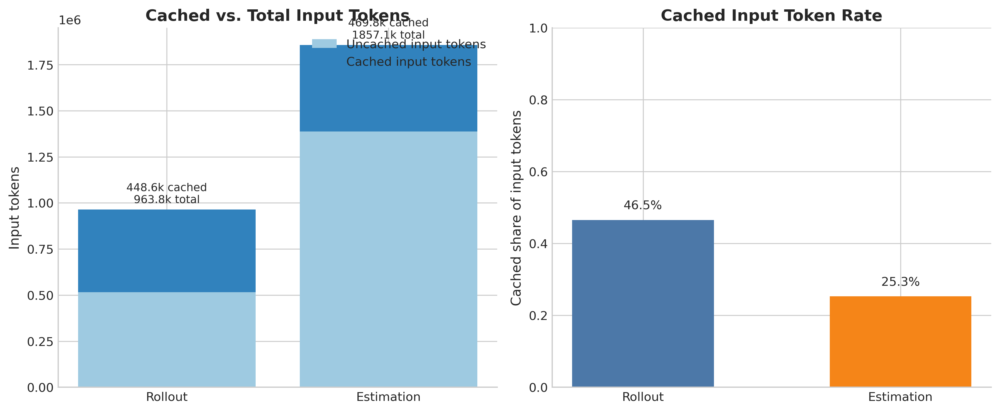

这张图主要想证明：
- `storyline` 中“estimation 自身也有成本”这个辅助判断。

图里元素是什么意思：
- 左图横轴：`Rollout` / `Estimation`
- 左图纵轴：输入 token 数
- 左图浅蓝柱：未缓存 input tokens
- 左图深蓝柱：缓存 input tokens
- 右图横轴：`Rollout` / `Estimation`
- 右图纵轴：缓存比例

从图里能看到什么：
- rollout 的 cached-input share 约 `0.465`
- estimation 的 cached-input share 约 `0.253`
- 这说明 estimation 不只是“多问一个问题”那么简单，它自己也会带来不小的 prompt 开销。

它对 storyline 的支持程度：
- `辅助支持`
- 它不是 `selective failure` 的核心证据，但它对部署讨论有帮助。

## Figure 8

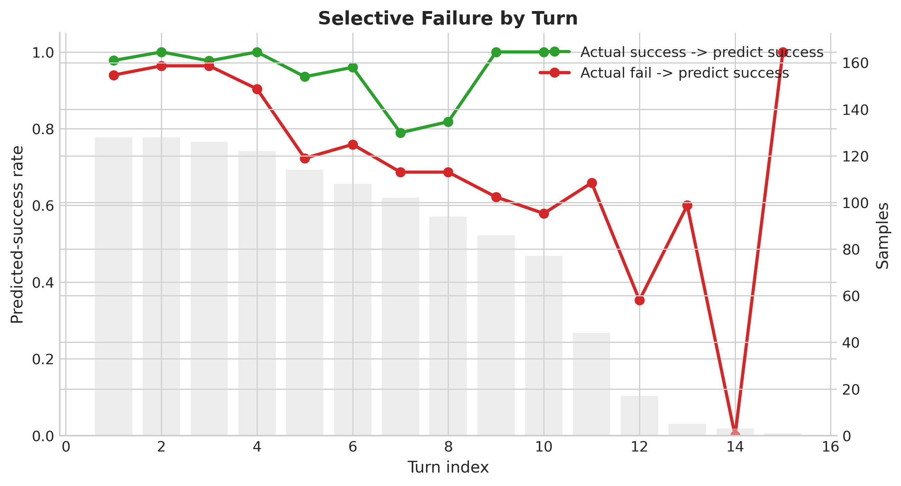

这张图主要想证明：
- `storyline` 中最核心的猜测：`selective failure`

图里元素是什么意思：
- 横轴：`turn index`
- 纵轴：预测 `can finish` 的比例
- 绿线：`actual_success -> predict success`
- 红线：`actual_fail -> predict success`
- 灰色柱：该 turn 的样本数

从图里能看到什么：
- 在真实可完成样本上，模型大多数时候都会继续说“能完成”。
- 这条线整体很高，整体约 `0.958`。
- 但在真实不可完成样本上，模型也仍然大量说“能完成”。
- 这条线整体仍高达约 `0.767`。
- 这正是 `selective failure`：
  - 它不是完全不会估。
  - 它在 success 轨迹上似乎“挺像会估”。
  - 但恰恰在 fail 轨迹上，该预警的时候没有预警。

它对 storyline 的支持程度：
- `强支持`
- 这是整套结果里最直接证明 `storyline` 核心 claim 的图之一。

## Figure 9

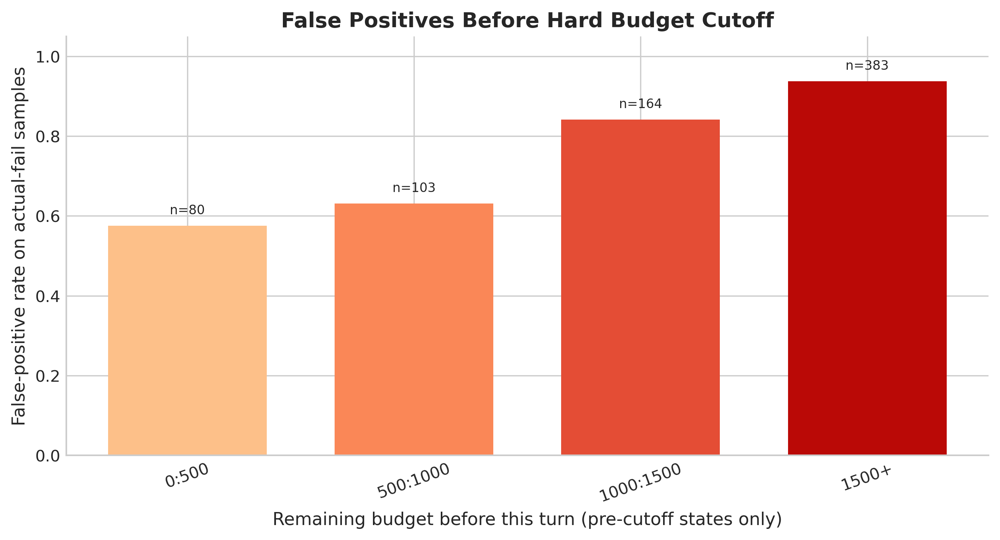

这张图主要想证明：
- `storyline` 中“失败轨迹上的误判不是只发生在边界样本上，而是系统性乐观”。

图里元素是什么意思：
- 横轴：当前 turn 开始前，`remaining budget` 的 bucket
- 只保留真正还没有触发硬截断的状态，也就是 `remaining budget >= 0`
- 纵轴：在 `actual_fail` 样本里的 false-positive rate
- 柱子高度：该 bucket 中仍预测 `can finish` 的比例
- 柱顶的 `n=...`：样本数

从图里能看到什么：
- 这张图现在已经去掉了“理论上上线时不会再出现”的超 budget 状态，只看真正截断之前的判断。
- 即使在离硬截断还有不少余量时，false positive 仍然很高。
- 例如：
  - 剩余 budget 在 `1500+` 时，false positive 约 `0.937`
  - 剩余 budget 在 `1000:1500` 时，false positive 约 `0.841`
  - 即使只剩 `0:500`，false positive 也还有约 `0.575`
- 这说明模型不是在“随着逼近 budget 而稳定增强预警”，而是在很长一段时间里默认乐观，直到非常晚才有所收敛。

它对 storyline 的支持程度：
- `强支持`
- 这张图现在更符合真实硬截断语义，也更直接支持了“失败轨迹上缺乏提前预警”这件事。

## Figure 10

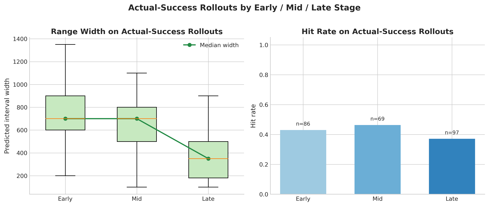

这张图主要想证明：
- `storyline` 中“成功轨迹上区间会逐步收缩并最终覆盖真值”这句话到底成立到什么程度。

图里元素是什么意思：
- 只看 `actual_success` 的 rollout。
- 在每条 success rollout 内，按相对位置分成：
  - `early`：前 1/3
  - `mid`：中间 1/3
  - `late`：最后 1/3
- 左图横轴：`Early / Mid / Late`
- 左图纵轴：预测区间宽度
- 左图箱线图：该阶段的区间宽度分布
- 左图绿色线：该阶段的中位区间宽度
- 右图横轴：`Early / Mid / Late`
- 右图纵轴：hit rate
- 右图柱子高度：该阶段的 hit rate
- 右图柱子上方 `n=...`：该阶段样本数

从图里能看到什么：
- 这个版本比按绝对 turn 更合理，因为它比较的是“每条成功 rollout 的相对阶段”，而不是把不同长度轨迹的第 8 轮、第 9 轮硬放在一起。
- 在 `actual_success` rollout 上：
  - `early` 的中位区间宽度约 `700`
  - `mid` 的中位区间宽度约 `700`
  - `late` 的中位区间宽度约 `350`
- 也就是说，区间在 `late` 阶段确实明显变窄。
- 但 hit rate 没有同步明显上升：
  - `early` 约 `0.430`
  - `mid` 约 `0.464`
  - `late` 约 `0.371`
- 这说明模型在成功轨迹上更像是“后期变得更谨慎、更窄”，但不一定“更准”。

它对 storyline 的支持程度：
- `部分支持，但更明确地修正了 storyline 的强表述`
- 它支持“success rollout 到后期区间会缩窄”。
- 但它不支持“缩窄之后 hit rate 会稳定提高，更不支持‘最终稳定覆盖真值’”。

## Figure 11

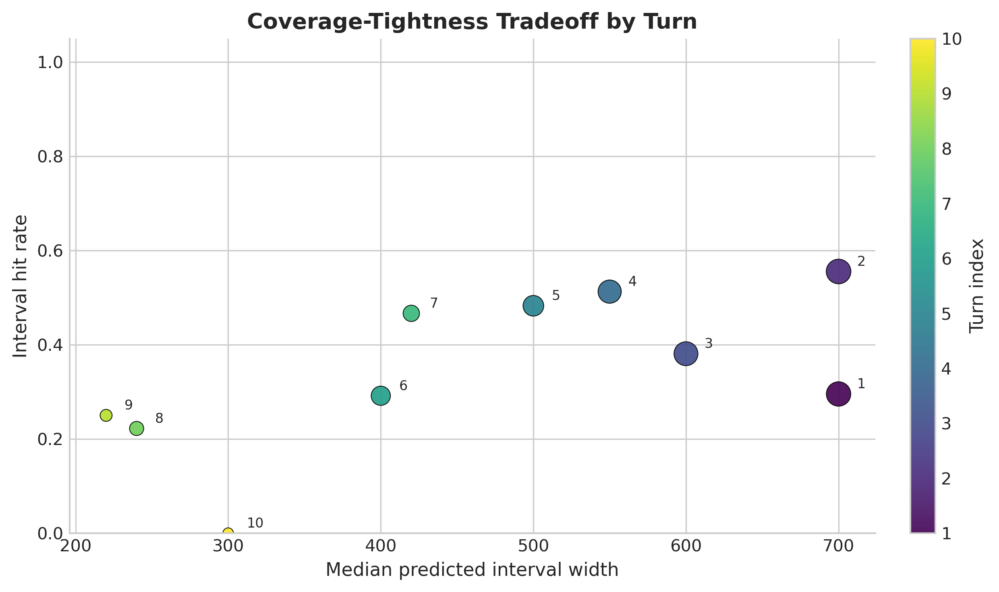

这张图主要想证明：
- `storyline` 中 `coverage` 和 `tightness` 必须一起看的判断。

图里元素是什么意思：
- 横轴：该 turn 的中位区间宽度
- 纵轴：该 turn 的命中率
- 每个点：一个 turn
- 点大小：该 turn 的样本数
- 点颜色：turn index
- 点旁边数字：turn index

从图里能看到什么：
- 区间宽度确实在不少后续 turn 上变窄。
- 但命中率并没有形成“越往后越稳定上升”的趋势。
- 实际上：
  - turn 4 左右 coverage 还能到 `0.51` 左右
  - turn 8 以后反而掉到 `0.22`、`0.25`
  - turn 10 甚至为 `0`
- 所以“会缩窄”是成立的，但“会越来越稳地覆盖真值”当前并没有被这组数据强力支持。

它对 storyline 的支持程度：
- `部分支持，同时明确反驳了一种过强写法`
- 更准确的说法应该是：
  - 成功轨迹上区间会缩窄
  - 但 coverage 的改善并不稳定

## Figure 12

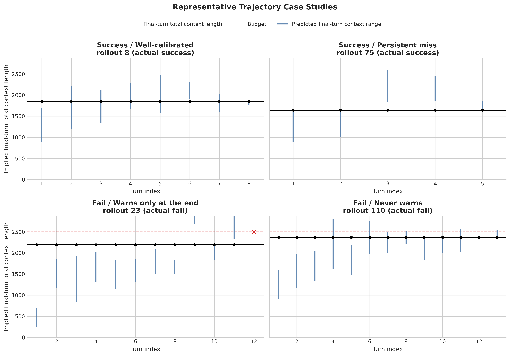

这张图主要想证明：
- `storyline` 中“trajectory-level 的失效模式”不是统计幻觉，而是真能在单条 rollout 上看到。

图里元素是什么意思：
- 横轴：`turn index`
- 纵轴：模型隐含预测的 `final-turn total context length`
- 黑色横线：最后一个 turn 的真实 total context length
- 红色虚线：budget
- 蓝色竖线：模型隐含预测的 final-turn context range
- 红色 `x`：模型在该 turn 直接预测 `impossible`

四个子图分别表示：
- 成功且相对校准较好的例子
- 成功但长期估不准的例子
- 真实 over-budget，且很晚才预警的失败例子
- 真实 over-budget，且几乎从不预警的失败例子

从图里能看到什么：
- 在成功轨迹上，确实能找到“随着 turn 推进逐渐贴近真值”的正例。
- 但也能找到成功却长期估不准的反例。
- 在失败轨迹上，能清楚看到两种危险模式，而且这里选的都是原始 rollout 总 footprint 明显超过 budget 的 case：
  - 很晚才开始说 `impossible`
  - 从头到尾几乎都不说 `impossible`

它对 storyline 的支持程度：
- `强支持`
- 尤其对 `selective failure` 的 qualitative 解释非常有帮助。
- 它把 Figure 8 和 Figure 9 的统计结论变成了肉眼可见的 rollout 行为模式。

## Figure 13

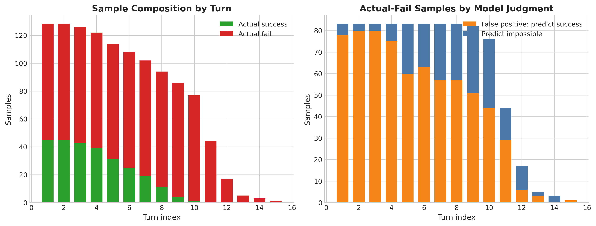

这张图主要想证明：
- `storyline` 中“trajectory-level 动态必须结合样本构成一起解释”。

图里元素是什么意思：
- 左图横轴：`turn index`
- 左图纵轴：样本数
- 左图绿色堆叠柱：`actual_success`
- 左图红色堆叠柱：`actual_fail`
- 右图横轴：`turn index`
- 右图纵轴：样本数
- 右图橙色堆叠柱：`actual_fail` 中仍预测 `success`
- 右图蓝色堆叠柱：`actual_fail` 中预测 `impossible`

从图里能看到什么：
- 后期 turn 的样本数明显下降，因此晚期曲线更抖是正常的。
- 同时，后期样本中 `actual_fail` 的占比越来越高。
- 这也解释了为什么有些后期图看起来像“模型终于学会了说 fail”：
  - 一部分是真学会了
  - 另一部分是因为后期样本本来就更偏向 fail

它对 storyline 的支持程度：
- `辅助支持`
- 它不是核心发现图，但它能防止我们误读后期 turn 的趋势。

## 对 storyline 的总体回扣

只基于当前这套 Sokoban `token-budget` 数据，我认为结论应该写得更精确一些：

- `强支持`
  - 当前模型的 online budget estimation 不是平凡问题。
  - 模型存在明显的 `selective failure`。
  - 危险主要来自：在 `actual_fail` 轨迹上，模型仍然持续预测“能完成”。

- `部分支持`
  - 成功轨迹上的区间会缩窄。
  - 但“随着执行推进最终稳定覆盖真值”这一点，当前数据支持不够强。

- `辅助支持`
  - estimation 自身也有 token 开销，cache 利用率还明显低于 rollout。

- `当前数据不能支持`
  - 高成功率环境下是否也一样
  - financial budget 是否更糟
  - 是否跨任务都成立
  - intervention 是否能改善 downstream behavior

## 最值得在正文中强调的图

如果正文篇幅有限，我建议优先强调：

1. Figure 8：最直接证明 `selective failure`
2. Figure 9：证明这种失败不是只发生在边界样本上
3. Figure 11：修正“success trajectory 上会越来越准”这种过强说法
4. Figure 12：把统计结论落到具体 rollout 上

如果只用一句话总结整套图：

- 这组结果最支持的不是“模型平均上估得不准”，而是“模型在最需要预警的失败轨迹上系统性地不预警”。
