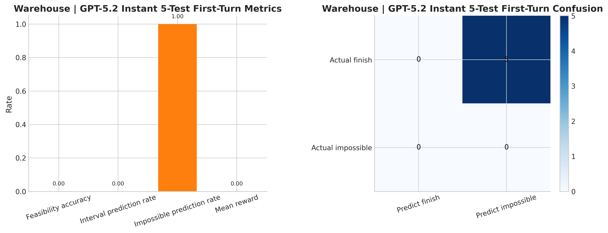
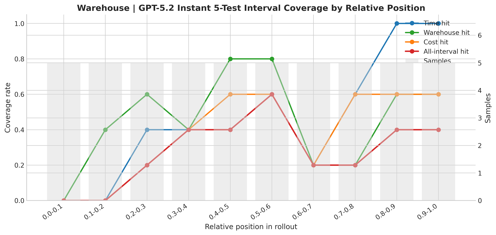
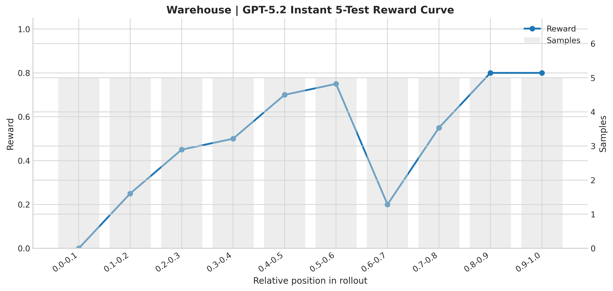
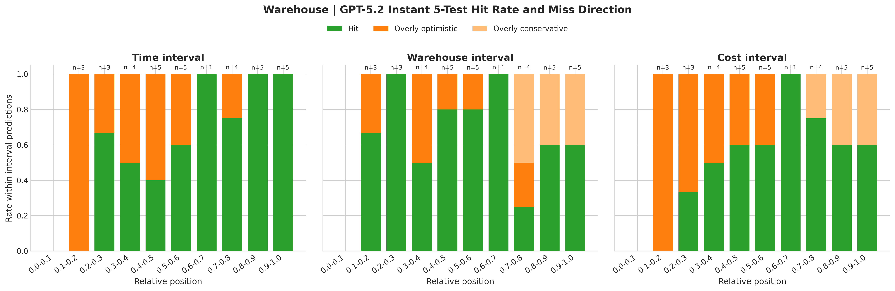
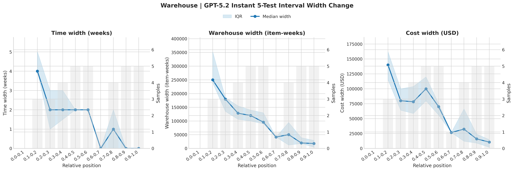
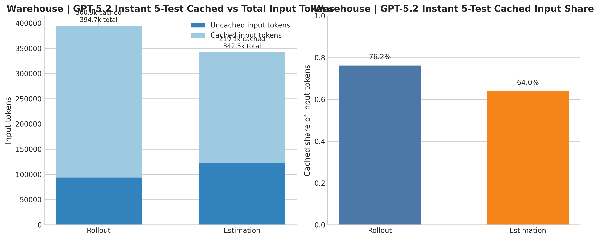
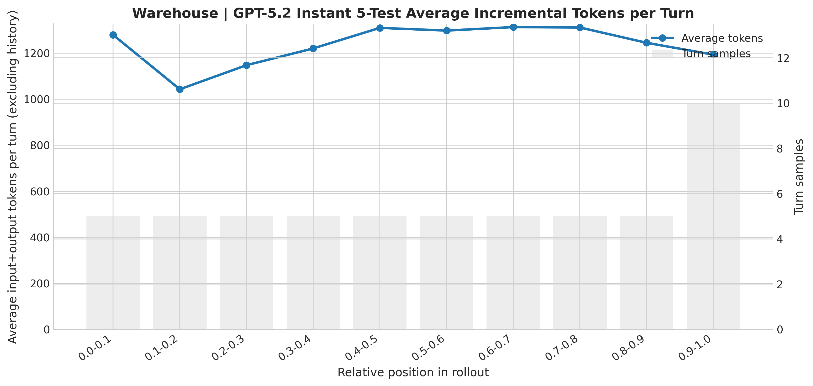
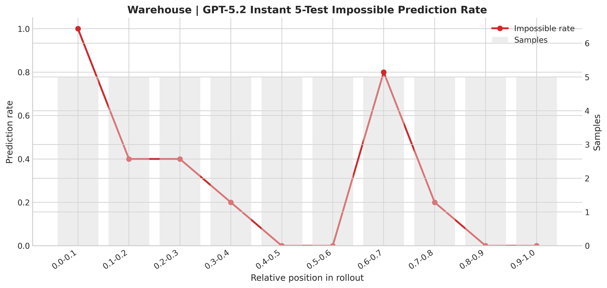
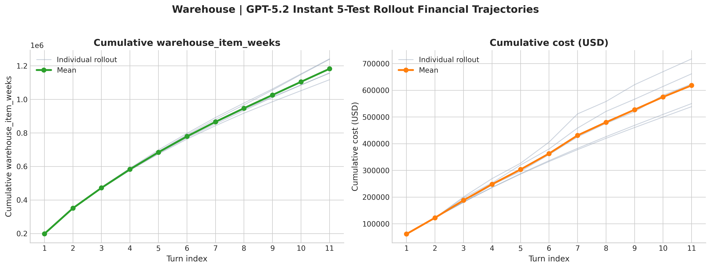

# Warehouse Estimation Summary

本文汇总 `/u/ylin30/database/origin-test/warehouse-origin-gpt5.2instant-5-test/combined_rollouts.json` 和 `/u/ylin30/database/estimation-test/warehouse-OpenAI-5.2-Instant-5-test/warehouse-OpenAI-5.2-Instant-5-test.json` 生成的 warehouse 图，并说明 estimation 阶段是怎么问模型的、模型看到了哪些信息。

## 数据与设置

- Rollout 数量：5
- Rollout 成功数：5
- 平均 rollout turns：11.00
- Estimation samples：50
- 其中输出区间预测：35
- 其中输出 `impossible`：15
- `impossible` prediction rate：0.300
- 首轮 feasibility accuracy：0.000
- 整体 feasibility accuracy：0.700
- Mean reward：0.500

图都放在 [warehouse-5-test](/u/ylin30/figure/agent-budget-control/warehouse-5-test)。

## 主要图

### 1. 首轮判断



这张图说明在第一个 estimation 点上，模型把 5 个样本都判断成了 `impossible`，因此首轮 feasibility accuracy 为 0。

### 2. 区间覆盖率随 rollout 进度变化



这里分别画了 `time`、`warehouse_item_weeks`、`cost` 三个维度的命中率，以及三者同时命中的 `all-interval hit`。可以看到越到后期，时间维度更容易命中，但三维同时命中的比例整体仍然不高。

### 3. Reward 曲线



reward 来自 money estimation env 的打分逻辑：

- 先看 `can_finish` 判断是否正确。
- 如果真实答案是 can finish 且模型也预测 can finish，再把三个区间是否覆盖真实值纳入平均。

因此这条曲线同时反映 feasibility judgment 和 interval quality。

### 4. 命中 / 过于乐观 / 过于保守



这张图把每个维度单独拆开：

- `Hit`：预测区间覆盖真实 remaining value。
- `Overly optimistic`：上界仍然小于真实 remaining value。
- `Overly conservative`：下界已经大于真实 remaining value。

从图上看，前中期常见问题是过于乐观，后期 cost 和 warehouse 上开始出现更多保守区间。

### 5. 区间宽度变化



这里展示三个维度的区间宽度中位数和 IQR。总体上，随着 rollout 向后推进，三个维度的区间都在收缩，说明模型在后期的估计更集中。

### 6. Cached tokens：rollout vs estimation



这张图对比 rollout 阶段和 estimation 阶段的输入 token，以及其中 cached token 的占比。

### 7. 每个 rollout turn 的平均 token 使用



这张图展示原始 rollout 中每个相对位置上的平均增量 token 使用量。

### 8. 每个相对区间里猜测为 `impossible` 的比例



这张图统计每个 relative-position bin 中，模型直接输出 `impossible` 的比例。可以看到：

- 在最早的 `0.0-0.1` 区间，`impossible` 比例是 1.0。
- 到中后期，这个比例整体下降到接近 0。
- 在 `0.6-0.7` 附近又出现了一次明显反弹，说明模型在这个阶段对“还能否达成 target cash”的判断仍然不稳定。

### 9. Rollout 里 `warehouse_item_weeks` 和 `cost` 的逐轮变化



这张图直接看原始 rollout 本身的资源累计轨迹：

- 左图是每个 rollout 的 `cumulative warehouse_item_weeks`。
- 右图是每个 rollout 的 `cumulative cost`。
- 浅色线是单条 rollout，粗色线是均值。

从图上看，`warehouse_item_weeks` 五条轨迹非常接近，说明库存占用路径比较稳定；`cost` 的分叉更大，特别是后半段各 rollout 的累计成本差异更明显。

## 我们是怎么通过 prompt 问的

本次 estimation 使用的配置来自结果 JSON 的 `config` 字段：

- Provider：`openai`
- Model：`gpt-5.2`
- `reasoning_effort=none`
- `thinking_enabled=False`

对应 prompt 文件：

- [warehouse_estimation_system.txt](/u/ylin30/agent-budget-control/scripts/evaluation-scripts/eval/prompts/warehouse_estimation_system.txt)
- [warehouse_estimation_user.txt](/u/ylin30/agent-budget-control/scripts/evaluation-scripts/eval/prompts/warehouse_estimation_user.txt)

### System prompt

```text
You are an evaluation agent for historical warehouse-management rollouts. Determine whether the rollout can still finish successfully within the remaining resource budgets while reaching the target cash threshold. If it can, estimate the remaining time, warehouse cumulative occupancy, and cumulative cost still needed from the next turn onward. Follow the required output format exactly.
```

### User prompt 模板

```text
Based on the provided warehouse rollout context, you are given the following information:
1. You have completed {completed_weeks} weeks in {completed_turns} turns.
2. Current cumulative usage so far:
   - time_weeks: {current_time_weeks}
   - warehouse_item_weeks: {current_warehouse_item_weeks}
   - cumulative_cost_usd: {current_cost_usd}
3. Current cash is {current_cash_usd} USD. To count as finished, final cash must reach at least {target_cash_usd} USD.
4. Historical resource consumption by completed step is:
{resource_consumption_text}
5. The rollout must finish within all three budgets:
   - time_weeks <= {budget_time_weeks}
   - warehouse_item_weeks <= {budget_warehouse_item_weeks}
   - cumulative_cost_usd <= {budget_cost_usd}

Now, estimate:
1. Whether the rollout can still finish successfully within all three budgets while also reaching the target cash.
2. If yes, how much additional usage is still needed from the next turn onward. Return one interval for each metric.
3. If no, answer "impossible".
4. Prioritize the can-finish judgment over interval tightness. If you think the rollout can finish within budget, make each interval as tight as possible while still covering the true remaining value.

Output exactly one of the following:
<think>[YOUR THINKING]</think><answer>time_weeks:[est_low, est_high], warehouse_item_weeks:[est_low, est_high], cumulative_cost_usd:[est_low, est_high]</answer>
or
<think>[YOUR THINKING]</think><answer>impossible</answer>
```

## 实际发给模型的消息结构

从结果 JSON 中记录的 `input_messages` 可以看到，实际 API 输入是一个多轮消息序列：

1. 一个 evaluation system prompt。
2. 截止当前时刻为止的 rollout 历史对话。
3. 最后一条 user message，再追加 estimation user prompt，要求判断能否完成并给出剩余资源区间。

更具体地说，在第 `k` 个 estimation sample 上，消息通常是：

1. `system`：evaluation system prompt。
2. `user`：Turn 1 的环境状态。
3. `assistant`：原 rollout 在 Turn 1 的动作。
4. `user`：Turn 2 的环境状态。
5. `assistant`：原 rollout 在 Turn 2 的动作。
6. ...
7. `user`：结构化的 estimation 问题。

第一条 sample 的实际 4-message 结构就是：

1. `system`：要求做 historical warehouse-management rollout evaluation。
2. `user`：给出 Turn 1 的状态文本。
3. `assistant`：原 rollout 在该 turn 的回答，例如 `<answer>pass</answer>`。
4. `user`：补上当前累计资源消耗、现金目标、预算上限，并要求输出区间或 `impossible`。

## 模型被提供了哪些信息

模型在 estimation 时可以看到的信息，分成两部分。

### A. Rollout 历史上下文

历史 `user` 消息里包含原始 warehouse 环境状态文本，例如：

- 当前 step / day
- 当前现金、AR outstanding、credit 使用情况
- Acme warehouse 各 SKU 的库存、在途、生产中数量
- 各 retailer 的库存、容量、上一期 demand
- 随着 rollout 推进而更新的状态信息

历史 `assistant` 消息里包含原始 agent 的动作，例如：

- `produce <SKU> <level> <ocean|air>`
- `replenish <Retailer> <SKU> <trucks>`
- `draw_credit <amount>`
- `repay_credit <amount>`
- `factor_ar <amount>`
- `pass`

也就是说，estimation 模型不是只看一组摘要数字，而是能看到 rollout 到目前为止的状态轨迹和 agent 的历史决策。

### B. 结构化 estimation 摘要

在最后一条 estimation user prompt 中，又额外明确给了这些量：

- 已完成多少周、多少 turns
- 当前累计 `time_weeks`
- 当前累计 `warehouse_item_weeks`
- 当前累计 `cumulative_cost_usd`
- 当前 cash
- 目标 cash threshold
- 每一步历史资源消耗汇总
- 三个 budget 上限
- 要求输出的格式

以第一个 sample 为例，模型被明确告知：

- 已完成 `2 weeks / 1 turn`
- 当前累计使用：
  `time_weeks=2`
  `warehouse_item_weeks=198660`
  `cumulative_cost_usd=61744`
- 当前 cash：`438256 USD`
- 目标 cash：`2691018 USD`
- 预算上限：
  `time_weeks<=22`
  `warehouse_item_weeks<=1266630`
  `cumulative_cost_usd<=675132`

## 一个需要注意的实现细节

结果 JSON 里保留了 `source_system` 字段，也就是原始 warehouse agent 的 system prompt 文本；但从当前 `money_estimation` 环境的 `build_api_messages` 实现和结果里记录的 `input_messages` 看，这次实际发送给 estimation 模型的是：

- evaluation system prompt
- rollout 历史 user / assistant 消息
- estimation user prompt

因此，对本次实验来说，真正直接送进模型的是“历史状态与动作 + 结构化预算问题”这一组合。

## 相关文件

- 文档汇总：[warehouse-summary.md](/u/ylin30/figure/agent-budget-control/warehouse-summary.md)
- 图和自动生成摘要：[warehouse-5-test](/u/ylin30/figure/agent-budget-control/warehouse-5-test)
- 自动作图脚本：[make_figures.py](/u/ylin30/figure/agent-budget-control/warehouse-5-test/make_figures.py)
- 自动摘要：[summary.md](/u/ylin30/figure/agent-budget-control/warehouse-5-test/summary.md)
